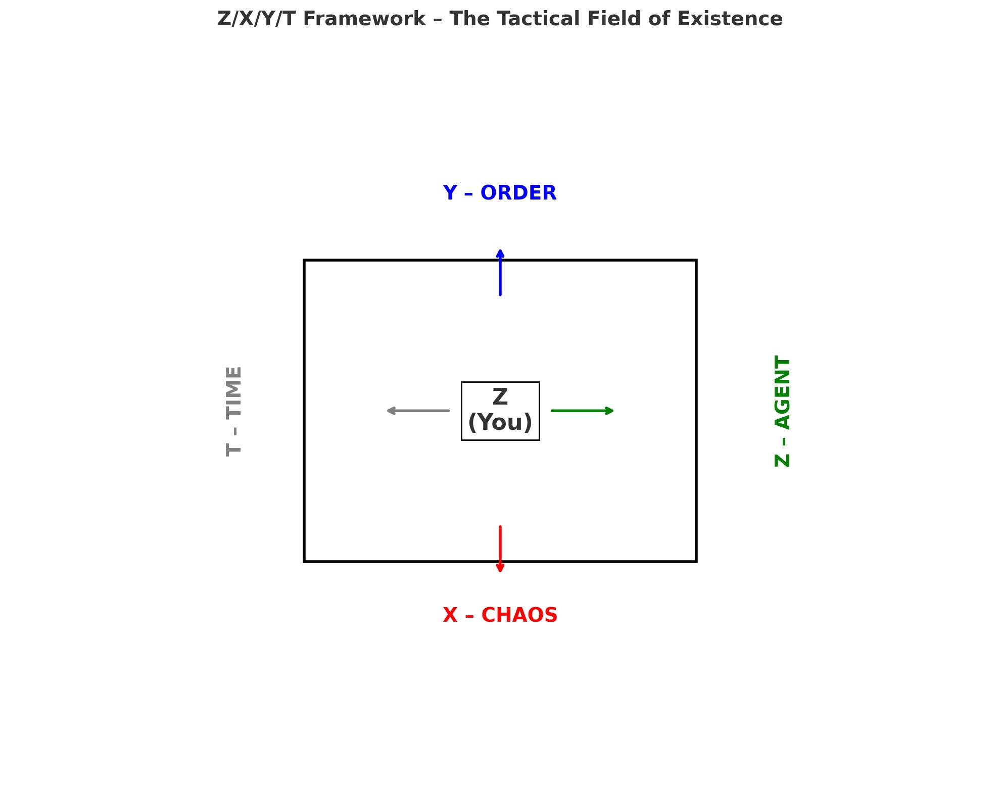
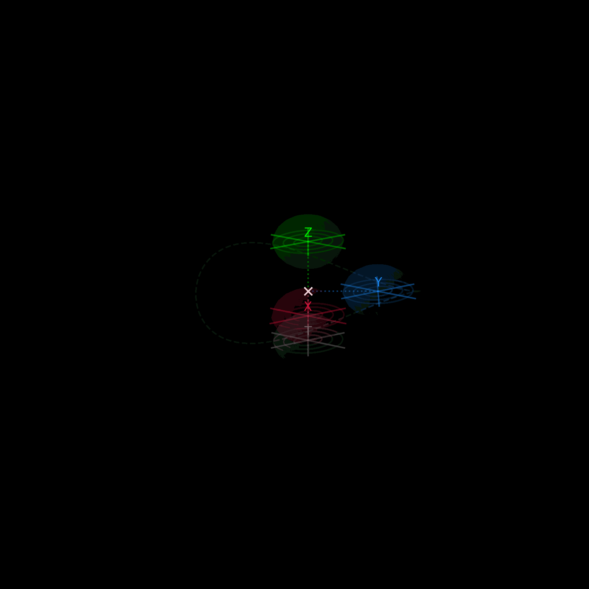
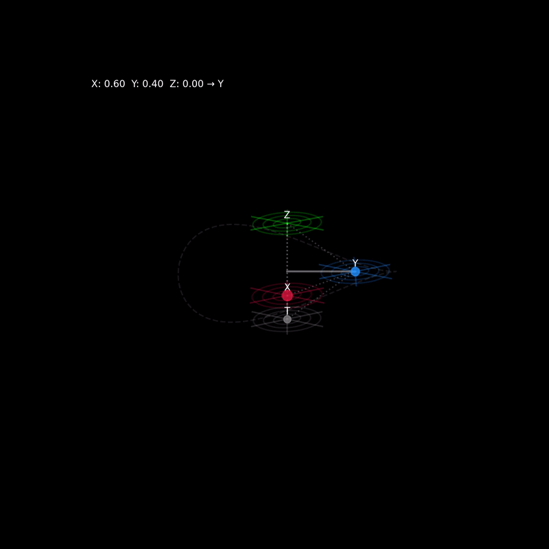

# zk-chaos-vm / 

**TL;DR** 

> Order / Chaos exploratory metaphysical environment
> A rudimentary toy-model exploring how order and chaos collapse under information pressure.  
> Simulates entropy stabilization as binary state progression.
A programmable entropy surface built to test the application of recursive collapse on systems.

This system simulates a deterministic loop influenced by non-linear entropy fluctuations.  
Each frame executes as a pseudo-ZX gate through a physics-stabilized interface.


### ⌁ System Visuals

<p align="center">
  
  <br />
  
  <br />
  
</p>

---

### 🛠 Local Setup

This system runs as a React-based entropy engine.  
To observe the collapse loop locally:

```bash
git clone https://github.com/0north-eth/zk-chaos-vm.git
cd zk-chaos-vm

1.npm install
2.npm start
3.http://localhost:3000

**Watch the binaries try to equalize**

### Ψ Core Mechanics

Let `S` = system state  
Let `T` = tick (frame progression)  
Let `ΔS` = change in state over time

We define:

ΔS = f(T) + e


Where `f(T)` represents expected structural flow and `e ∈ E` is emergent entropy injected per tick.  
The system strives for `ΔS → 0`, yet collapse is unavoidable as `e` exceeds stability thresholds.

At frame `Tₙ`, the system visualizes entropy saturation.

---

###  Interpretation

This toy system treats **chaos and order as binary runtime states**.

- Chaos is the default information signal within an environment that has not yet collapsed into structure.
- Order emerges as **low-entropy pockets** attempting to stabilize information.
- This model runs a visual loop where **entropy is injected** and the system tries, and fails, to contain it.

It is not designed to succeed.  
It is designed to **mirror the core truth of computation itself**:  
> Everything starts as noise.
  
This is a **live visual runtime map** used to explore entropy becomes meaning.

Eventually, this system can serve as:
- A compression model for zk runtime environments
- A generative map for entropic cipher logic
- A signal layer for zero-knowledge systems that reject consensus, but accept collapse

---

---
### ⌁ OBSERVE

- ZX-kernel interface  
- Layer-zero execution path  
- Instability encoded into state progression  
- Graphical proof of order | decay symmetry  
- Runtime inputs = non-linear ∴ loop behavior is emergent

---

### FgkaFhZ9EWESZWV9BQ8SCRgUFgkaFhZ9EWESZWV9BQ8SCRgUFgkaFhZ9EWESZWV9BQ8SCRg+SAgVZW97F2EHDX96CWEHDXMUFQAKZWJ8AxVzDBZwDW1zBnl6DAQQERZjCxUbZXtxbGEHDX9nYhIKFmJxD2EcAxZ7EAUWFxl3CgAcFhZ2Bw8WBGJ8YgQdEWR7EhhzAWR9FAQAZXcUARMKFWJ7BRMSFX59AWEFDGRgFwAfZXt1AQkaC3MUBw8FDGR7DAwWC2IaYhsLEH8UGBkGDBZuGhQaZTw+YQ4JZQ==

> `ψ`  
> The system leaks state.  
> The VM's recursive collapse can serve as bit-mapping for entropic systems.


---

Operated by [`0north.eth`](https://github.com/0north-eth)  
Entropy-injected runtime | zk-styled loop | proof-of-chaos surface  

  
**ZERO NORTH** ⦿ **ZERO NORTH**
